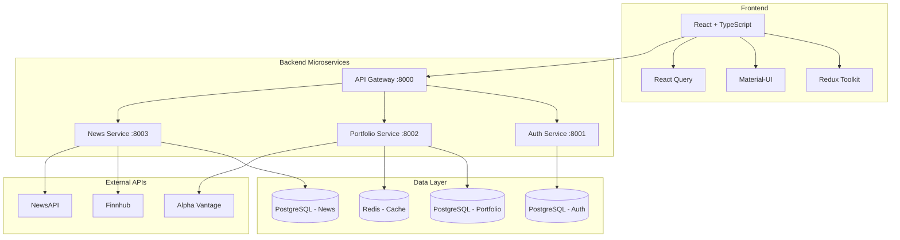

# FinTracker Pro: Enterprise-Grade Financial Portfolio Management Platform

<div align="center">

*A sophisticated, AI-powered financial portfolio tracker with real-time analytics, microservices architecture, and enterprise-grade security.*
</div>

***

## 🎯 Overview

FinTracker Pro is a comprehensive financial portfolio management platform built with modern web technologies and microservices architecture. It provides real-time market data, advanced analytics, AI-powered insights, and intuitive dashboards for investors of all levels.

### ✨ Key Features

🔹 **Real-Time Portfolio Tracking** - Live market data updates with WebSocket connections  
🔹 **Advanced Analytics** - Sharpe Ratio, Alpha, Beta, VaR, and custom risk metrics  
🔹 **AI-Powered Insights** - Machine learning models for market prediction and trend analysis  
🔹 **News Aggregation** - Multi-source financial news with sentiment analysis  
🔹 **Microservices Architecture** - Scalable, maintainable, and fault-tolerant backend  
🔹 **Enterprise Security** - JWT authentication, rate limiting, and data encryption  
🔹 **Responsive Design** - Mobile-first approach with Material-UI components  
🔹 **RESTful APIs** - Comprehensive API documentation with OpenAPI/Swagger  

***

## 🏗️ Architecture

### System Architecture Diagram



### 📁 Project Structure

```
fintracker/
├── 📂 backend/
│   ├── 🔐 auth-service/           # User authentication & authorization
│   ├── 💼 portfolio-service/      # Portfolio management & analytics
│   ├── 📰 news-service/          # Financial news aggregation
│   ├── 🌐 api-gateway/           # Request routing & load balancing
│   └── 🐳 docker-compose.yml     # Multi-container orchestration
├── 📂 frontend/
│   ├── 📂 src/
│   │   ├── 📂 components/        # Reusable UI components
│   │   ├── 📂 pages/            # Route-specific components
│   │   ├── 📂 store/            # Redux state management
│   │   ├── 📂 services/         # API service layer
│   │   ├── 📂 hooks/            # Custom React hooks
│   │   ├── 📂 utils/            # Utility functions
│   │   └── 📂 types/            # TypeScript definitions
│   ├── 📂 public/               # Static assets
│   └── 📜 package.json          # Dependencies & scripts
├── 📂 docs/                     # Documentation
├── 📜 README.md                 # This file
└── 📜 LICENSE                   # MIT License
```

***

## 🛠️ Technology Stack

### Frontend Technologies
- **Framework:** React 18.2.0 with TypeScript
- **State Management:** Redux Toolkit + React Query
- **UI Framework:** Material-UI (MUI) 5.14+
- **Styling:** Emotion CSS-in-JS
- **Build Tool:** Vite 4.5.0
- **Charts:** Recharts 2.8.0
- **Form Handling:** Formik + Yup validation

### Backend Technologies
- **Framework:** FastAPI 0.104.1 (Python)
- **Database:** PostgreSQL 15 with SQLAlchemy ORM
- **Caching:** Redis 7 for session & data caching
- **Authentication:** JWT tokens with refresh mechanism
- **API Documentation:** OpenAPI 3.0 / Swagger UI
- **Background Tasks:** Celery with Redis broker
- **Testing:** Pytest with async support

### DevOps & Infrastructure
- **Containerization:** Docker + Docker Compose
- **API Gateway:** Custom FastAPI-based gateway
- **Monitoring:** Built-in health checks
- **Logging:** Structured logging with Python's structlog
- **Database Migrations:** Alembic

### External APIs & Services
- **Market Data:** Alpha Vantage, Finnhub, Yahoo Finance
- **News:** NewsAPI.org, RSS feeds from major financial outlets
- **AI/ML:** Custom models for sentiment analysis and predictions

***

## 🚀 Quick Start

### Prerequisites

- **Docker & Docker Compose** (Recommended)
- **Node.js** 18+ and npm/yarn
- **Python** 3.12+ (for local development)
- **Git** for version control

### 1. Clone the Repository

```bash
git clone https://github.com/Shashwat-Akhilesh-Shukla/FINTRACKER.git
cd fintracker-pro
```

### 2. Environment Setup

Create `.env` files for each service:

```bash
# Backend environment files
cp backend/auth-service/.env.example backend/auth-service/.env
cp backend/portfolio-service/.env.example backend/portfolio-service/.env
cp backend/news-service/.env.example backend/news-service/.env

# Frontend environment file
cp frontend/.env.example frontend/.env
```

**Configure API keys in the respective `.env` files:**

```bash
# Required API Keys (free tier available)
ALPHA_VANTAGE_API_KEY=your_alpha_vantage_key
FINNHUB_API_KEY=your_finnhub_key
NEWS_API_KEY=your_news_api_key
```

### 3. Docker Deployment (Recommended)

```bash
# Start all services
docker-compose up --build

# Or run in background
docker-compose up -d --build
```

### 4. Manual Setup (Development)

**Backend Services:**
```bash
# Terminal 1 - Auth Service
cd backend/auth-service
pip install -r requirements.txt
uvicorn app.main:app --reload --port 8000

# Terminal 2 - Portfolio Service  
cd backend/portfolio-service
pip install -r requirements.txt
uvicorn app.main:app --reload --port 8001

# Terminal 3 - News Service
cd backend/news-service
pip install -r requirements.txt
uvicorn app.main:app --reload --port 8002

# Terminal 4 - API Gateway
cd backend/api-gateway
pip install -r requirements.txt
uvicorn app.main:app --reload --port 8080
```

**Frontend:**
```bash
# Terminal 5 - React Frontend
cd frontend
npm install
npm run dev
```

### 5. Access the Application

- **Frontend:** http://localhost:3000
- **API Gateway:** http://localhost:8080
- **API Documentation:** http://localhost:8080/docs

***

## 📊 Features Showcase

### Dashboard Analytics
- **Real-time portfolio valuation** with live market data
- **Interactive charts** showing performance over time
- **Risk metrics** including Sharpe ratio, Beta, and Value at Risk
- **Sector allocation** with visual breakdowns
- **Recent transactions** and activity feed

### Portfolio Management
- **Multi-asset support** (stocks, ETFs, bonds, crypto)
- **Automatic data synchronization** with market prices
- **Performance tracking** with benchmark comparisons
- **Tax optimization** insights and wash sale detection
- **Dividend tracking** and income projections

### News & Insights
- **Aggregated financial news** from trusted sources
- **Sentiment analysis** on market-moving events
- **Symbol-specific news** filtering
- **AI-powered market predictions** (coming soon)
- **Customizable news alerts** and notifications

***

## 🔧 Development Guide

### Setting up Development Environment

1. **Install Python dependencies:**
```bash
cd backend/auth-service
python -m venv venv
source venv/bin/activate  # On Windows: venv\Scripts\activate
pip install -r requirements.txt
```

2. **Database setup:**
```bash
# Create databases
createdb fintracker_auth
createdb fintracker_portfolio
createdb fintracker_news

# Run migrations
alembic upgrade head
```

3. **Frontend development:**
```bash
cd frontend
npm install
npm run dev
```

### API Development

Each microservice follows FastAPI best practices:

- **Async/await** for all database operations
- **Pydantic models** for request/response validation
- **SQLAlchemy 2.0** with async sessions
- **Comprehensive error handling** with custom exceptions
- **Request/response middleware** for logging and metrics

### Testing

```bash
# Backend tests
pytest backend/auth-service/tests/
pytest backend/portfolio-service/tests/
pytest backend/news-service/tests/

# Frontend tests
cd frontend
npm run test
npm run test:coverage
```

***

## 📘 API Reference

### Authentication Endpoints

```http
POST /api/v1/auth/register      # User registration
POST /api/v1/auth/login         # User login
POST /api/v1/auth/refresh       # Refresh access token
POST /api/v1/auth/logout        # User logout
GET  /api/v1/auth/me           # Get current user
```

### Portfolio Endpoints

```http
GET    /api/v1/portfolio/summary    # Portfolio overview
GET    /api/v1/portfolio/holdings   # All holdings
POST   /api/v1/portfolio/holdings   # Add new holding
GET    /api/v1/portfolio/metrics    # Advanced analytics
GET    /api/v1/portfolio/history    # Performance history
```

### News Endpoints

```http
GET  /api/v1/market/news           # Latest financial news
GET  /api/v1/market/news/trending  # Trending news
GET  /api/v1/market/news/symbols/{symbol} # Symbol-specific news
```

**📖 Complete API documentation available at `/docs` endpoint**

***

## 🛡️ Security Features

### Authentication & Authorization
- **JWT-based authentication** with secure token storage
- **Refresh token rotation** for enhanced security
- **Role-based access control** (RBAC) for different user types
- **Password hashing** with bcrypt and salt rounds

### Data Protection
- **Input validation** with Pydantic models
- **SQL injection prevention** through ORM usage
- **CORS configuration** for cross-origin requests
- **Rate limiting** to prevent abuse
- **HTTPS enforcement** in production

### Privacy & Compliance
- **Data encryption** at rest and in transit
- **User data anonymization** options
- **GDPR compliance** features
- **Audit logging** for security events

***

## 🚦 Performance & Scalability

### Frontend Optimizations
- **Code splitting** with React.lazy()
- **Bundle optimization** with Vite
- **Image lazy loading** and optimization
- **Service worker** for offline functionality
- **React Query caching** for API responses

### Backend Optimizations
- **Database indexing** on frequently queried fields
- **Redis caching** for expensive computations
- **Async processing** for long-running tasks
- **Connection pooling** for database connections
- **Horizontal scaling** ready architecture

### Monitoring & Observability
- **Health check endpoints** for all services
- **Structured logging** with correlation IDs
- **Performance metrics** tracking
- **Error tracking** and alerting
- **Database query optimization**

***

## 🧪 Testing Strategy

### Frontend Testing
- **Unit tests** with Jest and React Testing Library
- **Integration tests** for component interactions
- **E2E tests** with Playwright
- **Visual regression tests** for UI consistency
- **Accessibility testing** with axe-core

### Backend Testing
- **Unit tests** for business logic
- **Integration tests** for API endpoints
- **Database tests** with test fixtures
- **Security tests** for authentication flows
- **Load tests** with realistic data volumes

***
